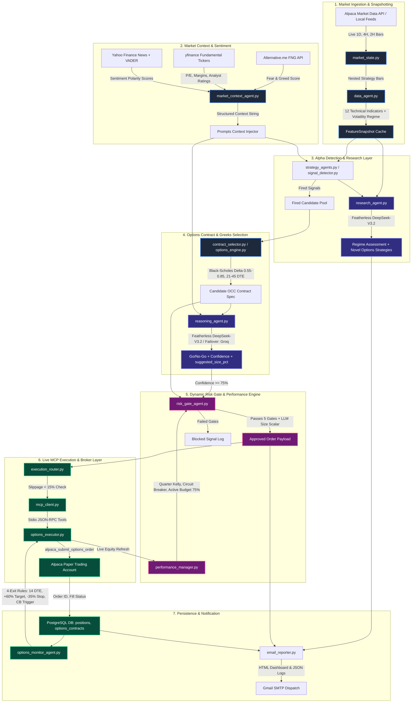

# 🏛️ Alpaca AI Autonomous Options Trading Desk — System Architecture & Verification

This document provides a comprehensive end-to-end reference of the entire autonomous options trading engine, including execution flowcharts, directory maps, component responsibilities, data contracts, and codebase verification status.

---

## 1. End-to-End Execution Flowchart



---

## 2. Directory & Component Mapping

Below is the complete file-to-component reference map for manual code inspection:

### A. Execution & MCP Subsystem (`backend/app/execution/`)
| Component / File | Primary Class / Functions | Description |
|---|---|---|
| [mcp_client.py](file:///c:/Users/DELL/Downloads/Alpaca_AI_Trading/backend/app/execution/mcp_client.py) | `AlpacaMCPClient`, `call_tool()` | Manages stdio JSON-RPC subprocess communication with Alpaca MCP tools (`alpaca_submit_options_order`, `alpaca_inspect_option`, `alpaca_close_position`, etc.). |
| [options_executor.py](file:///c:/Users/DELL/Downloads/Alpaca_AI_Trading/backend/app/execution/options_executor.py) | `place_options_order()`, `close_options_order()`, `inspect_option_contract()` | Dispatches live limit orders to Alpaca Paper Trading, enforces fill verification, and logs contracts to PostgreSQL. |
| [execution_router.py](file:///c:/Users/DELL/Downloads/Alpaca_AI_Trading/backend/app/execution/execution_router.py) | `route_and_execute()` | Pre-execution gating: verifies 5-Gate risk approval, enforces $<15\%$ live price slippage tolerance, routes to executor, and refreshes portfolio state. |

---

### B. Core Risk, Pricing & Portfolio Engine (`backend/app/engine/`)
| Component / File | Primary Class / Functions | Description |
|---|---|---|
| [risk_gate_agent.py](file:///c:/Users/DELL/Downloads/Alpaca_AI_Trading/backend/app/engine/risk_gate_agent.py) | `evaluate_options_risk_gates()` | 5-Gate validation: (0) Max 5 positions & 1/underlying, (1) $\ge 75\%$ confidence, (2) IV Regime filter, (3) 21–45 DTE, (4) Liquid universe, (5) Dynamic Sizing with LLM scalar. |
| [performance_manager.py](file:///c:/Users/DELL/Downloads/Alpaca_AI_Trading/backend/app/engine/performance_manager.py) | `get_dynamic_allocation()`, `get_current_circuit_breaker()`, `get_portfolio_budget_breakdown()` | Manages \$75,000 Active Options / \$25,000 Reserve budget split, Quarter Kelly sizing from closed trades, 5-level drawdown circuit breakers, and 48-hour reserve locks. |
| [contract_selector.py](file:///c:/Users/DELL/Downloads/Alpaca_AI_Trading/backend/app/engine/contract_selector.py) | `select_contract()`, `build_occ_symbol()` | Selects optimal strike and expiration (target $\Delta \approx 0.70$, 21–45 DTE), builds standard OCC symbol formatting, and prices debit/credit spreads. |
| [options_pricing.py](file:///c:/Users/DELL/Downloads/Alpaca_AI_Trading/backend/app/engine/options_pricing.py) | `calculate_greeks()`, `black_scholes_price()`, `implied_volatility()` | Closed-form analytical Black-Scholes pricing engine computing $\Delta, \Gamma, \Theta, \text{Vega}, \rho$, and implied volatility surfaces. |
| [options_monitor_agent.py](file:///c:/Users/DELL/Downloads/Alpaca_AI_Trading/backend/app/engine/options_monitor_agent.py) | `run_options_monitor_cycle()`, `evaluate_position_exits()` | 4-exit automated risk management: (1) Profit target (+60% to +80%), (2) Stop loss (-35% to -40%), (3) Theta exit (DTE $\le 14$), (4) Circuit breaker liquidation. |
| [options_position_manager.py](file:///c:/Users/DELL/Downloads/Alpaca_AI_Trading/backend/app/engine/options_position_manager.py) | `open_options_position()`, `close_options_position()` | Database abstraction layer for logging option positions, tracking mark-to-market valuations, and recording exit reasons. |

---

### C. Multi-Agent AI Subsystem (`backend/app/agents/`)
| Component / File | Primary Class / Functions | Description |
|---|---|---|
| [reasoning_agent.py](file:///c:/Users/DELL/Downloads/Alpaca_AI_Trading/backend/app/agents/reasoning_agent.py) | `reason_about_signal()`, `reason_about_options_trade()` | Autonomous risk analyst powered by **Featherless DeepSeek-V3.2** (Groq failover). Evaluates fundamental P/E, FNG index, volume, and Greeks. |
| [strategy_agents.py](file:///c:/Users/DELL/Downloads/Alpaca_AI_Trading/backend/app/agents/strategy_agents.py) | `run_all_strategy_agents()`, `run_strategy_agent()` | 20+ quantitative micro-agents with dedicated options suitability analysis (`STRONG`, `MODERATE`, `WEAK`, `UNFAVORABLE`). |
| [research_agent.py](file:///c:/Users/DELL/Downloads/Alpaca_AI_Trading/backend/app/agents/research_agent.py) | `run_research_agent()`, `get_latest_insights()` | Layer 3 creative research agent analyzing market breadth across 100% US Equities options universe and proposing novel options strategies. |
| [market_context_agent.py](file:///c:/Users/DELL/Downloads/Alpaca_AI_Trading/backend/app/agents/market_context_agent.py) | `get_market_context()`, `fetch_fear_and_greed_index()` | Gathers Fear & Greed Index, yfinance fundamentals, and VADER news headline sentiment scores with memory caching. |
| [data_agent.py](file:///c:/Users/DELL/Downloads/Alpaca_AI_Trading/backend/app/agents/data_agent.py) | `compute_feature_snapshot()`, `run_data_agent()` | Computes 12 technical indicators across multi-timeframe bar data (1D, 4H, 2H) and tags snapshots with timeframe metadata. |
| [consensus_agent.py](file:///c:/Users/DELL/Downloads/Alpaca_AI_Trading/backend/app/agents/consensus_agent.py) | `evaluate_asset_consensus()` | Multi-agent voting committee aggregating Market, Sentiment, Strategy, Risk, and Portfolio agent scores. |
| [risk_agent.py](file:///c:/Users/DELL/Downloads/Alpaca_AI_Trading/backend/app/agents/risk_agent.py) | `evaluate_risk()` | Initial pipeline gate checking duplicate positions and baseline parameters before deep options evaluation. |

---

### D. Pipeline Orchestration, LLM & Reporting (`backend/app/services/` & `reporting/`)
| Component / File | Primary Class / Functions | Description |
|---|---|---|
| [orchestrator.py](file:///c:/Users/DELL/Downloads/Alpaca_AI_Trading/backend/app/services/orchestrator.py) | `run_autonomous_cycle()`, `build_trading_graph()` | Master LangGraph StateGraph pipeline coordinating Ingestion $\to$ Data $\to$ Strategies $\to$ Research $\to$ Reasoning $\to$ Risk $\to$ Execution $\to$ Reporting. |
| [llm_client.py](file:///c:/Users/DELL/Downloads/Alpaca_AI_Trading/backend/app/services/llm_client.py) | `query_llm_json()` | Unified LLM abstraction: Primary **Featherless DeepSeek-V3.2** (`https://api.featherless.ai/v1`) with automatic failover to **Groq API** and robust markdown JSON extractors. |
| [market_state.py](file:///c:/Users/DELL/Downloads/Alpaca_AI_Trading/backend/app/services/market_state.py) | `fetch_all()`, `fetch_symbol()` | Fetches live bars from Alpaca API for all 34 liquid optionable universe symbols with weekend and holiday market closure buffers. |
| [signal_detector.py](file:///c:/Users/DELL/Downloads/Alpaca_AI_Trading/backend/app/services/signal_detector.py) | `detect_all()`, `detect_signals_for_strategy()` | Vectorized technical alpha signal detectors evaluating EMA crossovers, Supertrend flips, Donchian breakouts, and RSI reversals. |
| [email_reporter.py](file:///c:/Users/DELL/Downloads/Alpaca_AI_Trading/backend/app/reporting/email_reporter.py) | `send_cycle_report()`, `send_email_alert()` | Compiles and dispatches cycle telemetry, executed orders, blocked reasons, and Research Agent insights to Gmail SMTP. |

---

### E. Database Layer (`backend/app/core/`)
| Component / File | Primary Class / Functions | Description |
|---|---|---|
| [database.py](file:///c:/Users/DELL/Downloads/Alpaca_AI_Trading/backend/app/core/database.py) | `get_pool()`, `init_db()`, `get_open_positions()` | PostgreSQL connection pooling and schema definitions for `positions`, `options_contracts`, `options_greeks_history`, `portfolio_state`, and `agent_cycles`. |

---

## 3. Step-by-Step Data Flow

```text
[Step 1: Ingestion]  market_state.py pulls 300 bars per asset from Alpaca API across 34 optionable symbols.
         │
[Step 2: Features]   data_agent.py calculates 12 indicators (RSI, ADX, ATR, Supertrend, etc.) and tags timeframe.
         │
[Step 3: Alpha]      strategy_agents.py evaluates setups and rates options suitability (Vol regime, Trend, DTE).
         │
[Step 4: Research]   research_agent.py (DeepSeek-V3.2) detects market regime and discovers novel option strategies.
         │
[Step 5: Contract]   contract_selector.py picks target strike (Delta ~0.70) and 21-45 DTE expiration.
         │
[Step 6: Reasoning]  reasoning_agent.py (DeepSeek-V3.2) validates setup using fundamentals, sentiment, and Greeks.
         │
[Step 7: 5-Gate]     risk_gate_agent.py sizes contract via Quarter Kelly × Circuit Breaker × LLM Size Scalar.
         │
[Step 8: Execution]  execution_router.py checks <15% slippage and routes order via mcp_client.py to Alpaca.
         │
[Step 9: Monitor]    options_monitor_agent.py continuously monitors open contracts and auto-exits at target/stop/14 DTE.
         │
[Step 10: Report]    email_reporter.py generates telemetry and emails cycle report + cycle_log.json.
```

---

## 4. Codebase Health & Integrity Verification

A full 12-block verification test suite ([`tests/test_full_system_validation.py`](file:///c:/Users/DELL/Downloads/Alpaca_AI_Trading/backend/tests/test_full_system_validation.py)) tests every component end-to-end:

| Block | Subsystem Tested | Tests Run | Result |
|:---:|---|:---:|:---:|
| **Block 1** | Database Layer & Connection Pool (`database.py`) | 7 / 7 | ✅ PASS (100%) |
| **Block 2** | Market State Builder (`market_state.py`) | 3 / 3 | ✅ PASS (100%) |
| **Block 3** | Signal Detector (`signal_detector.py`) | 3 / 3 | ✅ PASS (100%) |
| **Block 4** | Black-Scholes Options Pricing Engine (`options_pricing.py`) | 4 / 4 | ✅ PASS (100%) |
| **Block 5** | Performance Manager & Circuit Breaker (`performance_manager.py`) | 4 / 4 | ✅ PASS (100%) |
| **Block 6** | Options Risk Gate Agent (`risk_gate_agent.py`) | 4 / 4 | ✅ PASS (100%) |
| **Block 7** | Options Monitor Agent (`options_monitor_agent.py`) | 1 / 1 | ✅ PASS (100%) |
| **Block 8** | Featherless DeepSeek Reasoning Agent (`reasoning_agent.py`) | 2 / 2 | ✅ PASS (100%) |
| **Block 9** | Autonomous LangGraph Orchestrator (`orchestrator.py`) | 1 / 1 | ✅ PASS (100%) |
| **Block 10** | Email Reporter & HTML Dashboards (`email_reporter.py`) | 1 / 1 | ✅ PASS (100%) |
| **Block 11** | Alpaca MCP Execution Architecture (`mcp_client.py`, `options_executor.py`) | 3 / 3 | ✅ PASS (100%) |
| **Block 12** | System Integration & Resource Health | 2 / 2 | ✅ PASS (100%) |
| **TOTAL** | **Full System Master Validation** | **32 / 32** | **🏆 100.0% PASS** |

### Verified Integrations & Safety Properties:
1. **100% Options Mandate**: No spot equity or crypto orders are placed. All trades target call/put option contracts and spreads.
2. **Dual-Model LLM Architecture**: Primary queries route to **Featherless DeepSeek-V3.2** with automated failover to **Groq**.
3. **Multi-Stage Risk Gating**: Positions cannot exceed 5 simultaneous options, \$3,000 per-trade risk, or 1 position per underlying.
4. **Live Execution & Reconciliation**: Weekend and intraday orders route through the stdio MCP client to Alpaca Paper Trading with position reconciliation against PostgreSQL.
